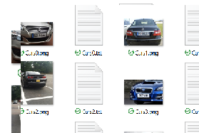
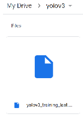

# yolo-data-preprocessing-and-training-tool

### Yolov3
You Only Look Once (YOLO) version 3 released in 2018. Uses variant of Darknet, with total of 106 layer fully convolutional underlying architecture for YOLO v3 (53 layer network trained on Imagenet and 53 more layers are stacked for detection). 

YOLO v3 makes prediction at three scales (The arrange anchors is descending order of a dimension), which are precisely given by downsampling the dimensions of the input image by 32, 16 and 8 respectively. At each scale, every grid can predict 3 boxes using 3 anchors. Since there are three scales, the number of anchor boxes used in total are 9 (Biggest anchors are assigned to the first scale and lowest to the third scale).

In YOLOv3 the detection is done by applying (1 x 1) detection kernels on feature maps of three different sizes at three different places in the network. The detection kernel is 1 x 1 x (B x (5 + C) )

`B is the number of bounding boxes.`

`“5” is for the 4 bounding box attributes and one object confidence.`

`C is the number of classes.`

The first detection is made by the 82nd layer. prior to this layer the image down sampled by network for all previous layers. The feature map from layer 79 is subjected to a few convolutional layers before being up sampled by 2x to dimensions (2 x dimensions). Then the combined feature maps is again subjected a few (1 x 1) convolutional layers to fuse the features from the earlier layer (61). This feature map is then depth concatenated with the feature map from layer 61. Then, the second detection is made by the 94th layer, yielding a detection feature map of (2 x dimensions).

Similar procedure is followed, the feature map from layer 91 is subjected to few convolutional layers before being depth concatenated with a feature map from layer 36. A few (1 x 1) convolutional layers follow to fuse the information from the previous layer (36). Final detection is made on layer 106th  yielding feature map of (2 x (2 x dimensions)).

Having 3 layers of detection helps with detecting objects of different sizes. The more the size of the layer increases (i.e. at 2 x dimensions) the better it is to detect smaller objects.


### Yolov3 Tools Repository 
This repository contains a set of tools gathered and modified persionally to fit the need of preprocessing and training computer vision datasets when preparing Yolov3 model.

##### Converting PASCAL to Yolo
Pseudo code for conversion (numbers are based on this [example](http://host.robots.ox.ac.uk/pascal/VOC/images/uiuc2a.html))

```sh
img_w = 174
img_h = 83

xmin = 39
ymin = 39

xmax = 138
ymax = 79 

# Calculate Size Percentage From Image 1
x = (xmin * 100) / img_w # 22.41
y = (ymin * 100) / img_h # 46.98
w = (xmax * 100) / img_w # 79.31
h = (ymax * 100) / img_h # 95.18

# Convert to value between (0.0-1.0)
x = x / 100 # 0.2241
y = y / 100 # 0.4698
w = w / 100 # 0.7931
h = h / 100 # 0.9518

# Yolov3 draw rectangle detection 
obj_x_center = int(detection[0] * img_w)
obj_y_center = int(detection[1] * img_h)
w = int(detection[2] * img_w)
h = int(detection[3] * img_h)
x = int(obj_x_center - w / 2)
y = int(obj_y_center -  h / 2) 

# Conversion Calculation
x = ( (xmax - xmin) / 2 + xmin) / img_w
y = ( (ymax - ymin) / 2 + ymin) / img_h
w = (xmax-xmin) / img_w
h = (ymax-ymin) / img_h
```

##### TXT Parses
Convert PASCAL Annotation Version 1.00 text file to the text format needed for yolov3. (Dataset Referenced)


##### XML Parser
Convert PASCAL VOC file to the text format needed for yolov3.

Modify the below accordignly by specifying the folder name of the images/dataset and the directory of the output text files containing the list of classes and the list of images in each train and test set accordingly.


```sh
data_dir = 'Custom-Dataset-or-Images-Folder-Name'
Detection_label_path = 'Custom-Dataset-or-Images-Folder-Name/classes.txt'
Dataset_train = "Custom-Dataset-or-Images-Folder-Name/train.txt"
Dataset_test = "Custom-Dataset-or-Images-Folder-Name/test.txt"
is_subfolder = True # if the data is in a sub-folder in the specified folder (data_dir)
```

##### Image Format
The repo contains an xml parser that extracts the xml tags of the image from the xml file and stores it in Yolov3 '.txt' format to fit the training.


`Object-class (Value 0 to Classes-1) is a number value representing the class`

`x-center (Value 0.0 to 1.0) located at % of the width`

`y-center (Value 0.0 to 1.0) located at % of the height`

`width (Value 0.0 to 1.0) is the width of the bounding box`

`height (Value 0.0 to 1.0) is the height of the bounding box`

After preparing the images/dataset to be trained, it shall be uploaded to google drive as zipped file. The zipped file shall contain both the imags and the text files having the same names.

 

##### Yolo Configuration File

max_batches = (number of classes) * 2000
Steps = (max_batches * 0.8), (max_batches * 0.9)
filters = (classes + 5) x 3

##### Train & Test Split
The dataset is divided into 80% training set and 20% test set.

```sh
train_img_list = []
test_img_list = []

train_80 = round(len(images_list) * 0.8)
test_20 = round(len(images_list) * 0.2)

for i in range(0, train_80):
  train_img_list.append(images_list[i])
for k in range(train_80, train_80+test_20):
  test_img_list.append(images_list[k])

print("Train Set {}: \n".format(len(train_img_list)), train_img_list)
print("Test Set {}: \n".format(len(test_img_list)), test_img_list)
```

##### Weights
The weights can be saved either on the cloud or in darknet backup folder (Weights are automatically saved upon the completion of 100 iterations).

  


### Usage:
When using/modifying the content or the code of and/or which was introduced thoguht this repository always do give appropriate credit and ask for permission when needed.


### Refrences
1. https://towardsdatascience.com/yolo-v3-object-detection-53fb7d3bfe6b
2. https://thebinarynotes.com/how-to-train-yolov3-custom-dataset/
3. https://medium.com/analytics-vidhya/train-yolo-v3-to-detect-custom-objects-car-license-plate-428ffa4d7aa6
4. https://pysource.com/2020/04/02/train-yolo-to-detect-a-custom-object-online-with-free-gpu/
5. https://storage.googleapis.com/openimages/web/index.html
6. https://pjreddie.com/darknet/yolo/
7. https://www.cis.upenn.edu/~jshi/ped_html/
8. https://www.visiongeek.io/2019/10/preparing-custom-dataset-for-training-yolo-object-detector.html
9. https://bitbucket.org/ElencheZetetique/rtod/src/master/